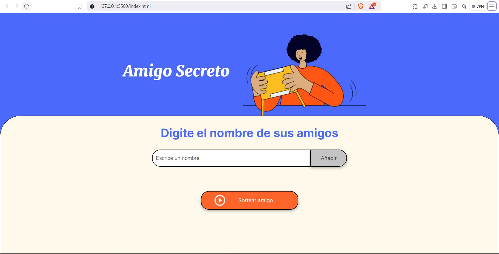
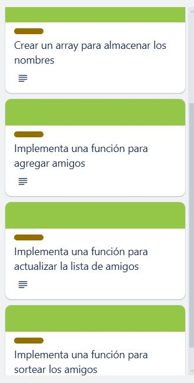
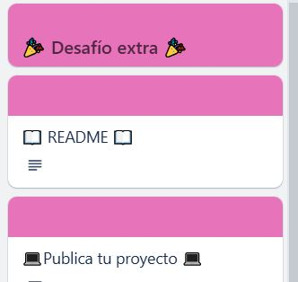
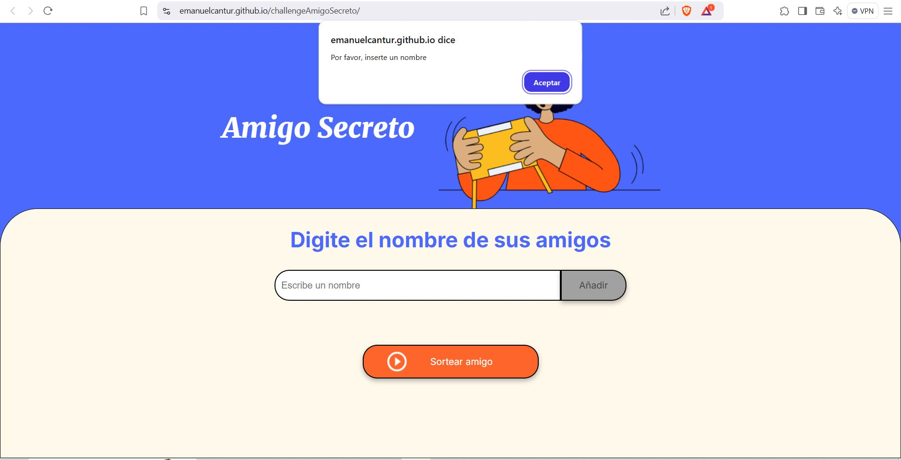
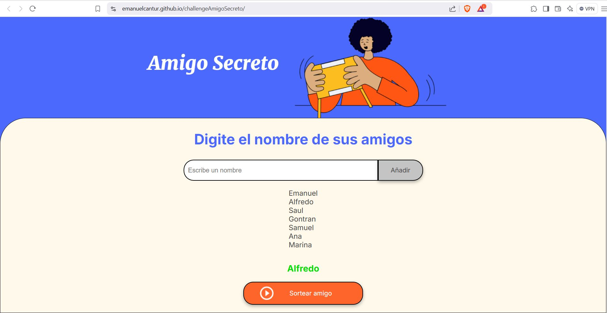

# Challenge Amigo secreto

Este proyecto es mi primer challenge realizado en la plataforma de Alura latam para poder avanzar en el programa ONE(Oracle Next Education) que Oracle ofrece con el apoyo de Alura.
Este primer reto esta echo para que el estudiante ponga a prueba los conocimientos adquiridos en los primeros modulos a realizar para poder ser parte de la octava generación en este programa.

Este challenge esta pensando para poder practicar la lógica de programación, por lo que en primer instancia se nos presenta un proyecto que incluye un archivo Html y una hoja de estilos(CSS) que nos genera la interfaz que se visualiza a continuación:

- Después de descargar este proyecto se nos encomienda algunas tareas por realizar en el archivo app.js, las cuales se muestran a continuación:

 

- Todas las funciones del proyecto realizadas se deben ir subiendo a un repositorio en github para realizar la entrega del repositorio al concluir el challenge.
- Como retos adicionales a este proyecto se incluye realizar un README.md del proyecto y publicar el proyecto terminado con github pages.

  

- El proyecto publicado lo puedes encontrar en [esta página](https://emanuelcantur.github.io/challengeAmigoSecreto/)

- Para probar las funciones que se solicitan en el challenge lo primero seria intentar añadir un nombre cuando la caja de texto que se muestra esta vacia, lo que nos deberia de mostrar la alerta que se muestra a continuación:

- La siguiente función seria colocando un nombre en la caja de texto y presionando el boton añadir, deberia poder añadirse un numero indeterminado de amigos, y cada que se vaya añadiendo un nuevo amigo se deberia de mostrar en la parte de abajo los nombres que se van añadiendo con letras en color negro:

- La siguiente función es para sortear un amigo, esta función deberia elegir uno de los nombres añadidos a la lista al azar, y mostrarlo en letras verdes en la parte de abajo:

.

#### Con esto concluyo mi challenge, muchas gracias por visitar este proyecto, si deseas contactarte conmigo para realizar una pregunta puedes hacerlo a través de mi [Linkedin](https://www.linkedin.com/in/emanuel-cant%C3%BA-rodr%C3%ADguez-72742a1bb/).